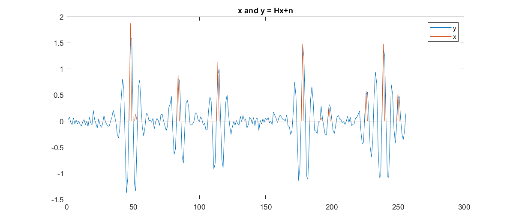
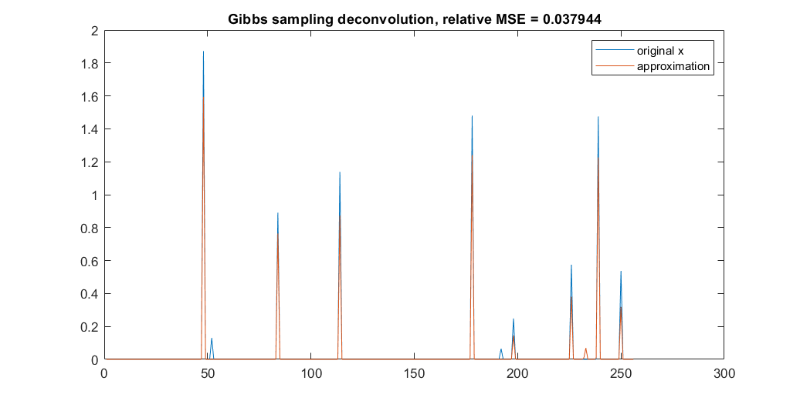

# Inverse Problems Project: Deconvolution of a Sparse Signal

*see [`report.pdf`](./report.pdf) for a more detailed description of the project*

In this project, our main goal was to solve an inverse problem of the form _y = Hx + n_, with a sparse signal _x_, Gaussian noise _n_ and convolution matrix _H_. To do so we will make use of simulation following probability laws and descent algorithms for convex optimization, which will be introduced in parts I and II before being used to solve the inverse problem in part III.

## Part I
Simulation of a Gaussian law truncated to positive values through the cumulative distributive function inversion method and accept-reject methods.

## Part II
Descent methods: gradient descent and Newton method.

## Part III
Deconvolution of the sparse signal through convex optimization and Gibbs sampling (Bayesian setting).

## Concluding remarks
In this project, we solved the inverse problem _y = Hx + n_ with sparse _x_. To do so, we used a slightly modified version of the descent algorithms seen in part II and we also developed a Gibbs sampler that used the algorithms seen in part I to generate the components of _x_. The descent and simulation following a probability law algorithms presented here could be used to solve various other inverse problems in different forms. The results were consistent with what was expected from the theoretical calculations and we presented means of choosing which method is best suited to a given problem.
